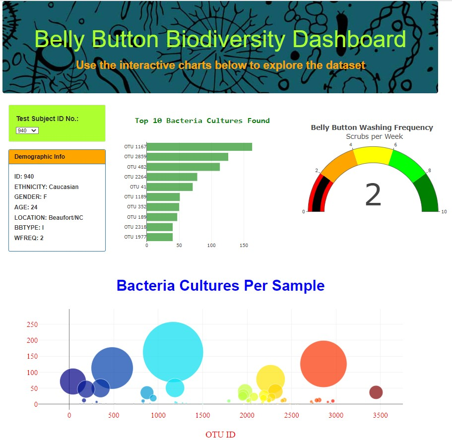

### belly_button_biodiversity_dashboards\

VISIT WEBSITE HERE - https://manjamcmills.github.io/belly_button/

# Background and Purpose
The data used for this challenge was a JSON file that contained samples of bacteria from the belly button of hundreds of volunteers.  This data was studied to try and find a bacteria that mimicked the taste of beef for a hypothetical company "Improbable Beef". 
The purpose of this challenge was to showcase the data on a webpage visualization using Plotly, JavaScript, and HTML.  This website allows a volunteer's data to be looked up by "patient ID#" and then all of their info would be show in the following charts:

